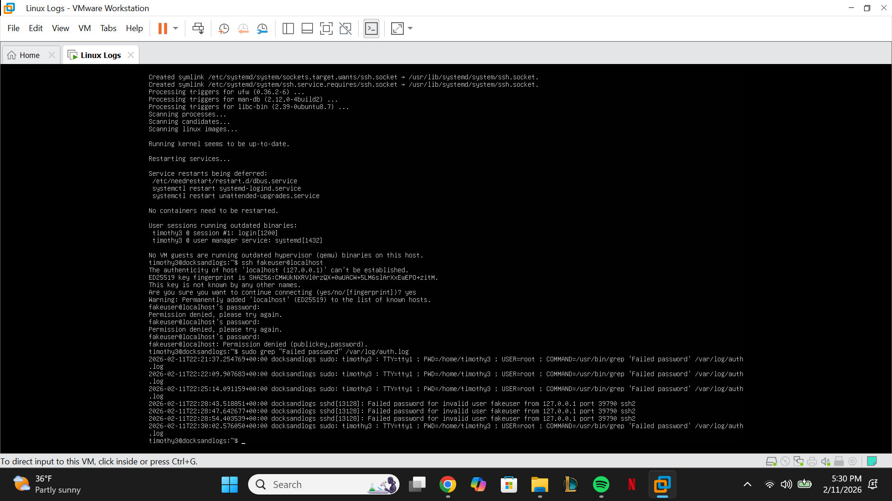

# Linux Log Analysis

## Overview
My project is a Bash script that analyzes Linux authentication logs to detect failed SSH login attempts and identify suspicious IP addresses. It provides a simple report to monitor system security and gain hands-on experience with Linux system administration and security monitoring.

## Tools & Technologies
- Ubuntu Server (VMware)
- Bash scripting
- Linux commands: grep, awk, sort, uniq
- VMware Workstation / Player

## Features
- Count total failed login attempts
- Display top 5 IP addresses causing failed logins
- Show recent failed login activity
- Can be automated with cron jobs (optional)

## Usage
1. Make the script executable:
   ```bash
   chmod +x log_analyzer.sh
   sudo ./log_analyzer.sh
   sudo ./log_analyzer.sh > security_report.txt

## Screenshots




## Learning Outcomes
- Parsed Linux log files using grep and awk
- Wrote Bash scripts for automation
- Gained experience analyzing system security logs
- Learned how to document and share a project on GitHub

## Future Steps
- Automate daily log analysis with cron jobs
- Send email alerts for suspicious activity
- Expand analysis to system logs beyond authentication logs
